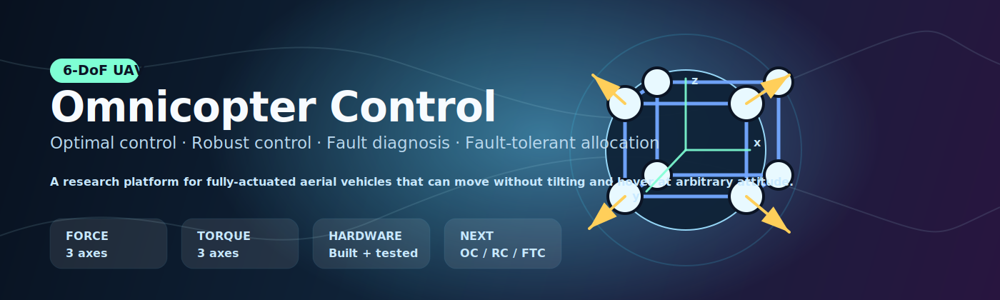
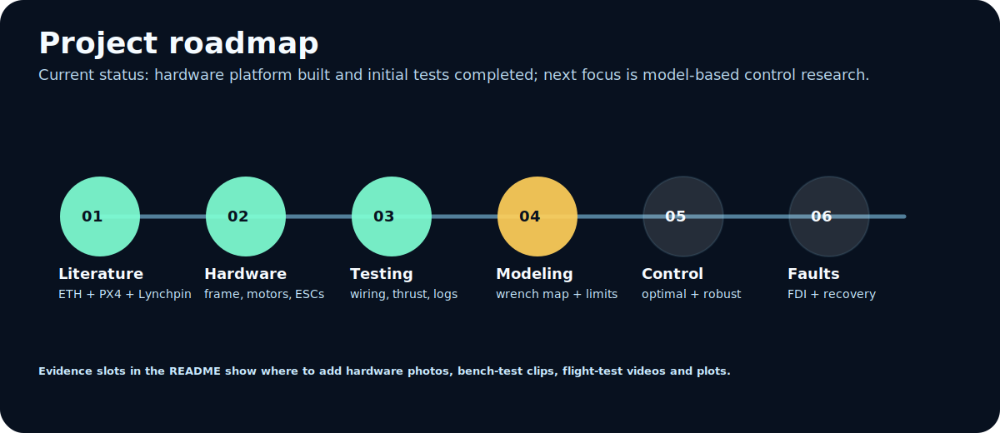
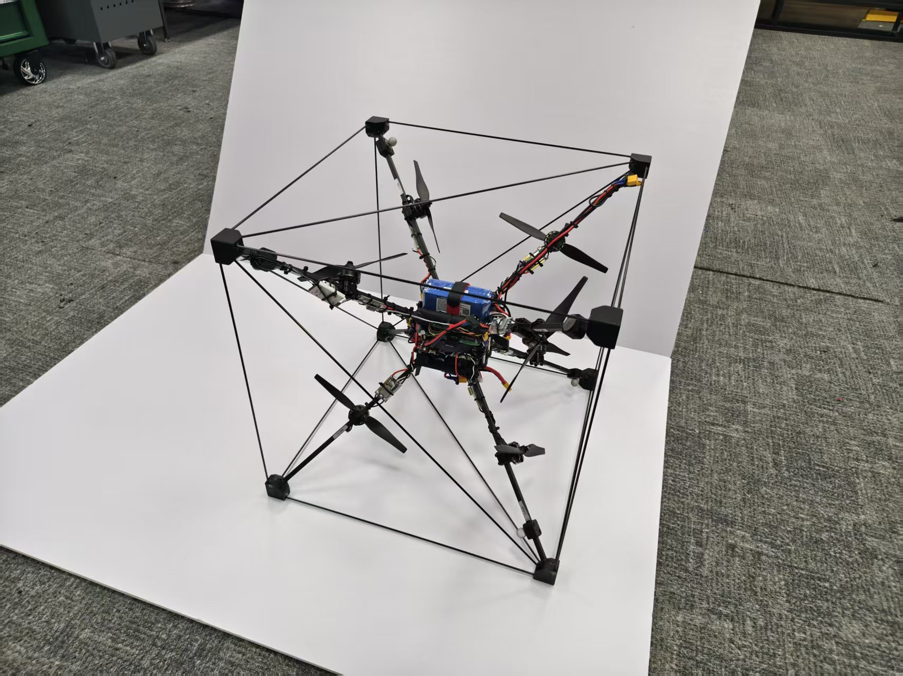
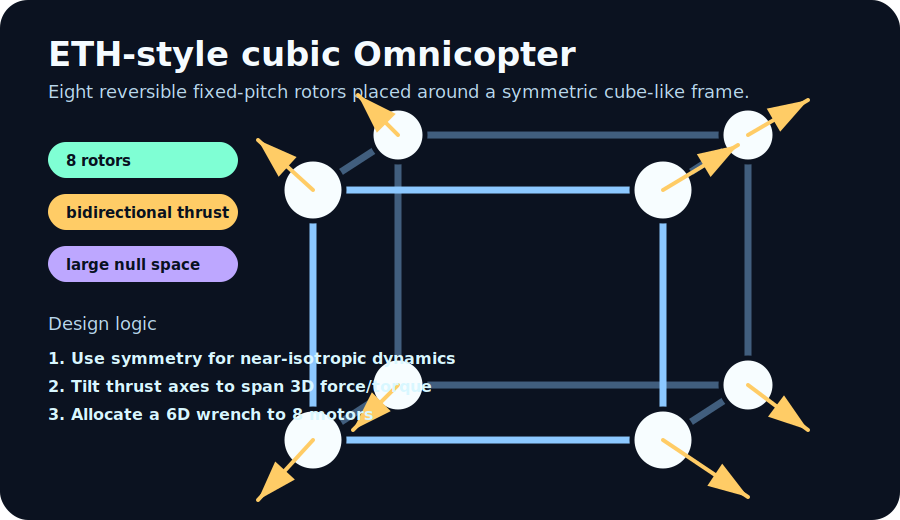
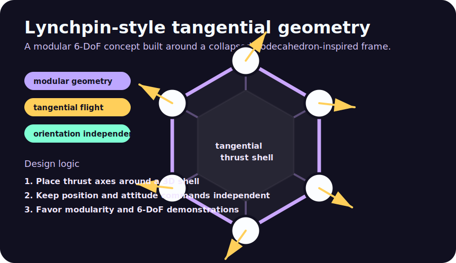
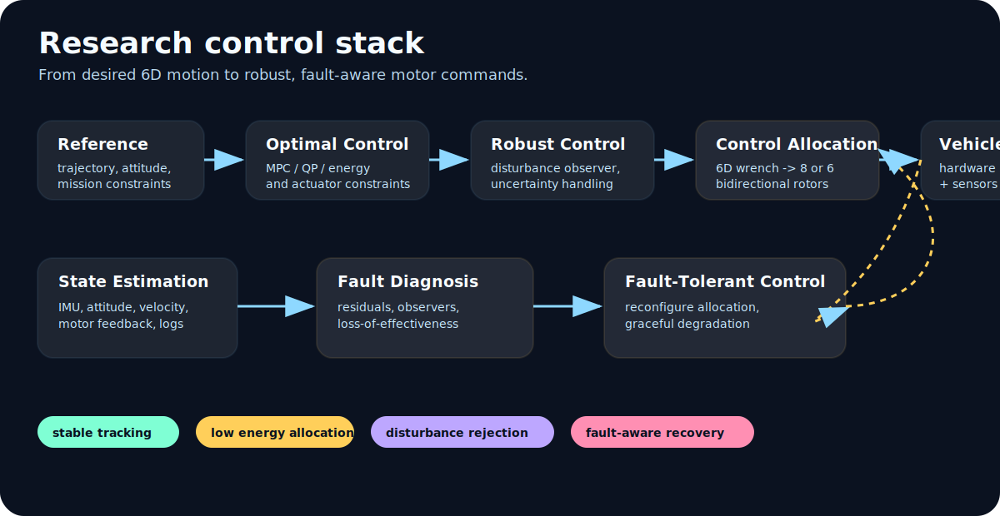
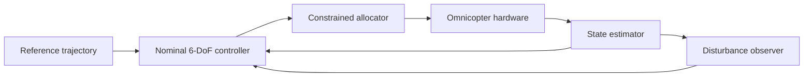
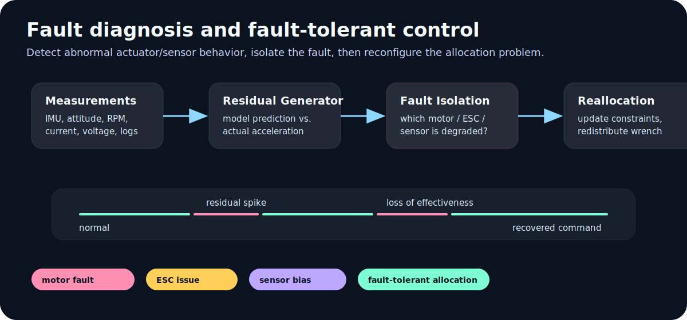

<p align="center">
  
</p>

<h1 align="center">🚁 Omnicopter Control Research</h1>

<p align="center">
  <b>Optimal Control · Robust Control · Fault Diagnosis · Fault-Tolerant Control</b><br>
  A hardware-based research project for fully-actuated 6-DoF aerial vehicles.
</p>

<p align="center">
  
  
  
  
</p>

<p align="center">
  <a href="#-start-here">Start Here</a> ·
  <a href="#-what-is-an-omnicopter">What is an Omnicopter?</a> ·
  <a href="#-why-build-one">Motivation</a> ·
  <a href="#-implementation-path">Implementation</a> ·
  <a href="#-research-focus">Research Focus</a> ·
  <a href="#-media-gallery">Media</a> ·
  <a href="#-references">References</a>
</p>

---

## 🧭 Start Here

This repository documents our exploration of **Omnicopter design, modeling, optimal control, robust control, and fault-tolerant control**.

An Omnicopter is not just “a drone with more propellers”. It is a **fully-actuated aerial vehicle** that can command force and torque in all three spatial dimensions. In practice, this means it can:

- 🔼 move upward, downward, sideways, forward, and backward **without needing to tilt first**;
- 🔄 rotate around roll, pitch, and yaw while maintaining position;
- 🧲 hover at unusual or even inverted attitudes when actuator limits allow;
- 🛡️ use actuator redundancy for safer control allocation and fault recovery.

> **Project statement:** build and test an Omnicopter hardware platform, then use it as a research testbed for **optimal control**, **robust control**, and **fault diagnosis / fault-tolerant control**.

---

## ✨ Project at a Glance

| Item               | Description                                                                                |
| ------------------ | ------------------------------------------------------------------------------------------ |
| 🛩️ Vehicle type  | Omnidirectional / fully-actuated multirotor UAV                                            |
| 🎯 Research target | Optimal allocation, robust 6-DoF tracking, actuator/sensor fault diagnosis                 |
| 🧱 Hardware status | A complete Omnicopter hardware platform has been constructed and tested                    |
| 🧠 Core challenge  | Convert a desired 6D wrench into safe, efficient, and fault-aware motor commands           |
| 🧪 Validation path | Bench tests → simulation → tethered flight → free flight → fault-injection experiments |

<p align="center">
  
</p>

---

## 🎬 Media Gallery

GitHub README files do not render YouTube `<iframe>` embeds reliably, so videos are inserted using **clickable thumbnails**. Click any thumbnail to watch the video.

<table>
<tr>
<td width="50%" align="center">
  <a href="https://www.youtube.com/watch?v=nsPkQYugfzs">
    
  </a>
  <br>
  <b>PX4-based Omnicopter with dynamic control allocation</b>
  <br>
  <sub>Useful reference for PX4 control allocation and practical 6-DoF flight.</sub>
</td>
<td width="50%" align="center">
  <a href="https://www.youtube.com/watch?v=0p9jmrf1eFM">
    
  </a>
  <br>
  <b>ArduCopter 6-DoF OmniCopter outside demo</b>
  <br>
  <sub>Useful reference for Lynchpin-style outdoor demonstrations.</sub>
</td>
</tr>
<tr>
<td width="50%" align="center">
  <a href="https://www.youtube.com/watch?v=sIi80LMLJSY">
    
  </a>
  <br>
  <b>ETH Zurich Omnicopter</b>
  <br>
  <sub>Original omni-directional six-degree-of-freedom flying machine.</sub>
</td>
<td width="50%" align="center">
  <a href="https://www.youtube.com/watch?v=0gR1ekapOAE">
    
  </a>
  <br>
  <b>Trajectory generation for fully-actuated multirotors</b>
  <br>
  <sub>Useful reference for trajectory-level optimal control ideas.</sub>
</td>
</tr>
</table>

### 📸 Our hardware evidence slots

Replace the placeholder images below with real photos or thumbnails from our platform.

<table>
<tr>
<td width="40%" align="center">
  
  <br>
  <b>Hardware prototype photo</b>
  <br>
  <sub>Suggested replacement: <code>assets/hardware_prototype.jpg</code></sub>
</td>
<td width="60%" align="center">
  <video src="assets/bench_test_thumbnail.mp4" controls width="100%">
    Your browser does not support the video tag.
  </video>
  <br>
  <b>Bench / tethered test video</b>
</td>
</tr>
</table>

---

## 🚁 What is an Omnicopter?

A conventional multirotor is usually **under-actuated**. It can generate thrust mainly along the body vertical axis, so horizontal motion requires the vehicle to tilt. This couples translation and rotation:

```text
Want to move sideways?
    → tilt the drone
    → thrust vector gains horizontal component
    → attitude and position are coupled
```

An **Omnicopter** breaks this limitation by arranging rotor positions and thrust axes in 3D. The goal is to generate a full 6D wrench:

$$
\mathbf{y} =
\begin{bmatrix}
\mathbf{F} \\
\boldsymbol{\tau}
\end{bmatrix}
= M \mathbf{f}_{prop}
$$

where:

- $\mathbf{F}$ is the 3D body force;
- $\boldsymbol{\tau}$ is the 3D body torque;
- $\mathbf{f}_{prop}$ is the vector of propeller thrusts;
- $M$ is the geometry-dependent allocation matrix.

For rotor $i$, a simplified force/torque contribution is:

$$
\mathbf{F} = \sum_i f_i \mathbf{x}_i,
\qquad
\boldsymbol{\tau} = \sum_i f_i (\mathbf{p}_i \times \mathbf{x}_i)
$$

where $\mathbf{p}_i$ is the rotor position relative to the center of mass and $\mathbf{x}_i$ is the rotor thrust-axis direction.

### 🧩 Conventional multirotor vs. Omnicopter

| Capability                             | Conventional quad / octocopter |                           Omnicopter |
| -------------------------------------- | -----------------------------: | -----------------------------------: |
| Move up/down without tilting           |                             ✅ |                                   ✅ |
| Move sideways without tilting          |                             ❌ |                                   ✅ |
| Hover at arbitrary attitude            |                             ❌ |           ✅, within actuator limits |
| Independently command 3D force         |                             ❌ |                                   ✅ |
| Independently command 3D torque        |                 Mostly limited |                                   ✅ |
| Actuator redundancy for fault recovery |                        Limited | Stronger, depending on configuration |
| Control difficulty                     |                         Medium |                                 High |

---

## 💡 Why Build One?

The design motivation is simple: **many aerial robotics tasks require force control, not just position control**.

Traditional multirotors are excellent for photography, mapping, inspection, and general flight. However, their under-actuation becomes a bottleneck when the vehicle needs to:

- 🧱 interact physically with walls, ceilings, tools, or objects;
- 🪛 apply force while maintaining a chosen attitude;
- 🧭 fly through constrained spaces without pointing the whole body in the direction of motion;
- 🧪 test advanced control allocation and fault-tolerant control algorithms;
- 🛟 survive partial actuator degradation by redistributing control effort.

For our project, the Omnicopter is valuable not because it is easy to fly, but because it is a **rich control problem**:

```text
Geometry design
    ↓
6D force/torque map
    ↓
Optimal control allocation
    ↓
Robust tracking under uncertainty
    ↓
Fault diagnosis and recovery
```

---

## 🧱 Implementation Path

An Omnicopter can be implemented in several ways. Our project focuses on two useful reference families:

1. **ETH-style cubic Omnicopter** — an eight-rotor, fixed-pitch, reversible-propeller configuration.
2. **Lynchpin-style tangential Omnicopter** — a modular 6-DoF concept based on a geometric frame and tangential thrust logic.

---

## 🔷 ETH-style Cubic Configuration

<p align="center">
  
</p>

The ETH-style Omnicopter is one of the most important reference designs for this project. It uses **eight fixed-pitch rotors** mounted around a symmetric cube-like frame. The rotors are not all pointing in the same direction. Instead, their thrust axes are arranged so that the combined actuator set can generate force and torque in all three dimensions.

### 🧠 ETH design logic

The ETH configuration follows several key ideas:

| Design idea                             | Why it matters                                               |
| --------------------------------------- | ------------------------------------------------------------ |
| 🧊 Symmetric 3D frame                   | Makes the vehicle dynamics closer to orientation-invariant   |
| 🌀 Tilted thrust axes                   | Allows force generation beyond the body vertical direction   |
| 🔁 Reversible motor-propeller actuators | Allows positive and negative thrust along each rotor axis    |
| 🎛️ Over-actuation                     | More actuators than 6D wrench dimensions creates redundancy  |
| 🧮 Control allocation                   | Converts desired force/torque into individual motor commands |

### ✅ Advantages

- Strong theoretical foundation for 6-DoF force/torque authority.
- Compatible with optimization-based allocation and null-space methods.
- Suitable for studying arbitrary-attitude hover and decoupled translation/rotation.
- Closely connected to PX4 Omnicopter documentation and open-source implementation references.

### ⚠️ Practical issues

- Bidirectional propellers and ESC 3D mode need careful setup.
- Motor reversal is slower than same-direction thrust changes.
- Aerodynamic interference between nearby rotors can produce model mismatch.
- A pseudo-inverse allocator can command infeasible thrusts unless constraints are handled.

### 📌 Why it is useful for us

The ETH configuration is a strong baseline for our research because it gives a clear mathematical structure:

```text
Desired position + attitude
        ↓
Desired 3D force + 3D torque
        ↓
Allocation matrix M
        ↓
8 reversible rotor thrust commands
```

This is ideal for studying **optimal allocation**, **actuator saturation**, **null-space optimization**, and **fault-tolerant reconfiguration**.

---

## 🟣 Lynchpin-style Tangential Configuration

<p align="center">
  
</p>

The Lynchpin-style configuration is another useful reference because it approaches 6-DoF flight from a different geometric intuition. Instead of emphasizing a cube-like 8-rotor layout, it uses a **collapsed-dodecahedron-inspired modular frame** and places motors/propellers around the frame in a way that supports **tangential omnidirectional flight**.

The Lynchpin contest requirement can be summarized as:

> The drone should rotate into any orientation while maintaining position, and it should move in any direction regardless of its orientation.

### 🧠 Lynchpin design logic

| Design idea                                     | Why it matters                                                                  |
| ----------------------------------------------- | ------------------------------------------------------------------------------- |
| 🧬 Modular geometry                             | Supports repeated geometric units and possible multi-drone / structure ideas    |
| 🧭 Tangential thrust layout                     | Produces forces around a 3D shell rather than only along one body axis          |
| 🔄 Independent position and orientation control | The pilot/controller should command position and attitude separately            |
| 🛠️ Hobby-grade feasibility                    | Demonstrations have used common multirotor components and open autopilot stacks |

### ✅ Advantages

- Attractive geometry for modular aerial robotics.
- Potentially fewer propulsion units than an 8-rotor cubic configuration.
- Good conceptual reference for arbitrary-attitude motion.
- Useful for comparing how geometry affects allocation conditioning and fault tolerance.

### ⚠️ Practical issues

- Less standardized than the ETH/PX4-style reference design.
- Geometry and actuator directions must be modeled very carefully.
- Fewer actuators may reduce redundancy for fault-tolerant allocation.
- The controller must still handle bidirectional thrust, actuator limits, and motor dynamics.

### 📌 Why it is useful for us

The Lynchpin-style configuration is useful as a **comparison case**:

```text
ETH-style:      symmetry + 8 rotors + allocation redundancy
Lynchpin-style: modular geometry + tangential logic + compact 6-DoF concept
```

By comparing both, we can ask research questions such as:

- Which geometry gives better force/torque isotropy?
- Which configuration gives a better-conditioned allocation matrix?
- How much actuator redundancy is needed for safe fault recovery?
- Which design is more efficient for arbitrary-attitude hovering?

---

## 🛠️ Our Hardware Progress

We have already constructed a complete Omnicopter hardware platform and performed initial tests. This platform is intended to serve as the physical testbed for the control research in this repository.

### ✅ Current progress

- [X] Reviewed ETH Omnicopter and Lynchpin-style design references.
- [X] Selected a feasible Omnicopter hardware configuration for research use.
- [X] Built a complete Omnicopter hardware platform.
- [X] Performed initial hardware-level tests.
- [X] Prepared the platform for control-oriented experiments.
- [ ] Identify or refine the thrust/torque allocation matrix.
- [ ] Build a simulation model for controller validation.
- [ ] Implement constrained optimal allocation.
- [ ] Add robust tracking controller.
- [ ] Add fault diagnosis and fault-tolerant reallocation.
- [ ] Validate with repeatable flight experiments.

### 🧪 Hardware test evidence to add

| Evidence                 | Suggested file path                    | README insertion                             |
| ------------------------ | -------------------------------------- | -------------------------------------------- |
| Prototype overview photo | `assets/hardware_prototype.jpg`      | Replace the placeholder in the media section |
| Wiring / ESC close-up    | `assets/wiring_closeup.jpg`          | Add below this table                         |
| Motor direction test     | `assets/motor_test_thumbnail.jpg`    | Link to video attachment or YouTube          |
| Bench thrust test plot   | `assets/thrust_test_plot.png`        | Add in the modeling section                  |
| Tethered flight video    | `assets/tethered_test_thumbnail.jpg` | Link to GitHub user-attachment video         |
| Flight log plot          | `assets/log_position_attitude.png`   | Add in the experiment section                |

Example for adding our own video thumbnail:

```md
[](https://github.com/USER/REPO/assets/VIDEO_ID)
```

---

## 🧮 Modeling Foundation

The Omnicopter can be modeled as a rigid body with six controllable degrees of freedom. The key object is the **allocation matrix** $M$:

$$
\begin{bmatrix}
\mathbf{F} \\
\boldsymbol{\tau}
\end{bmatrix}
= M\mathbf{u}
$$

where $\mathbf{u}$ represents individual actuator thrust commands.

### 🔍 What we need to identify

| Model item                     | Why we need it                                |
| ------------------------------ | --------------------------------------------- |
| Rotor position$\mathbf{p}_i$ | Determines torque from off-center thrust      |
| Rotor axis$\mathbf{x}_i$     | Determines the direction of generated force   |
| Thrust coefficient             | Maps command / RPM to thrust                  |
| Drag torque coefficient        | Improves yaw and torque prediction            |
| Motor reversal delay           | Important for bidirectional thrust allocation |
| Saturation limits              | Required for feasible optimal control         |
| Rate limits                    | Prevents unrealistic thrust changes           |
| Aerodynamic interference       | Important for robust control and compensation |

### 🧪 Suggested identification workflow

```text
1. Measure geometry
   p_i, x_i, center of mass, frame axes

2. Static actuator calibration
   command -> thrust, command -> current, command -> RPM

3. Dynamic actuator calibration
   thrust step response, reversal delay, rate limit

4. Build initial allocation matrix
   y = M u

5. Validate against IMU / motion capture / log data
   predicted acceleration vs measured acceleration

6. Update model
   add bias, scaling, saturation, coupling, disturbance terms
```

---

## 🧠 Research Focus

<p align="center">
  
</p>

This project lands on three major control directions:

1. **Optimal Control** — make the 6D motion and motor allocation efficient and constraint-aware.
2. **Robust Control** — maintain stable tracking under modeling errors, disturbances, and aerodynamic coupling.
3. **Fault Diagnosis / Fault-Tolerant Control** — detect degraded actuators or sensors and reconfigure the controller.

---

## 🎯 1. Optimal Control

Optimal control is used when we want the vehicle to satisfy motion goals while minimizing a cost and respecting constraints.

For an Omnicopter, the most immediate optimal-control problem is **control allocation**:

> Given a desired 6D wrench, choose motor thrusts that generate it safely and efficiently.

### 🧩 Baseline allocation

A simple baseline is the pseudo-inverse allocator:

$$
\mathbf{u} = M^\dagger \mathbf{y}_{des}
$$

This is easy to implement, but it may fail when:

- one or more motors saturate;
- thrust commands require impossible reversal timing;
- the desired wrench is outside the attainable wrench set;
- a motor is degraded or failed;
- we want to minimize energy, noise, heat, or current.

### � Better allocation: constrained QP

A more practical allocator can be written as a quadratic program:

$$
\begin{aligned}
\min_{\mathbf{u}} \quad &
\|M\mathbf{u} - \mathbf{y}_{des}\|_Q^2
+ \lambda \|\mathbf{u} - \mathbf{u}_{prev}\|^2
+ \rho J_{rev}(\mathbf{u})
+ \eta J_{energy}(\mathbf{u}) \\
\text{s.t.} \quad &
\mathbf{u}_{min} \leq \mathbf{u} \leq \mathbf{u}_{max} \\
& \Delta \mathbf{u}_{min} \leq \mathbf{u} - \mathbf{u}_{prev} \leq \Delta \mathbf{u}_{max}
\end{aligned}
$$

where:

- $\|M\mathbf{u} - \mathbf{y}_{des}\|_Q^2$ tracks the desired wrench;
- $\|\mathbf{u} - \mathbf{u}_{prev}\|^2$ discourages aggressive thrust changes;
- $J_{rev}$ penalizes motor reversal;
- $J_{energy}$ penalizes current / power consumption;
- constraints enforce actuator limits.

### 🧭 Optimal-control research questions

- How can we allocate thrust while avoiding unnecessary motor reversal?
- Can we use the null space of $M$ to minimize energy without changing the produced wrench?
- How should force and torque tracking be weighted when full tracking is infeasible?
- Can MPC improve arbitrary-attitude trajectory tracking compared with cascaded PID control?
- How do ETH-style and Lynchpin-style geometries differ in attainable wrench space?

### 🧪 Planned experiments

| Experiment                   | Metric                                     |
| ---------------------------- | ------------------------------------------ |
| Static wrench tracking       | force/torque error                         |
| Arbitrary-attitude hover     | position and attitude RMS error            |
| Circular trajectory tracking | position error, motor usage                |
| Motor reversal penalty test  | reversal count, tracking degradation       |
| Energy-aware allocation      | current draw, flight time estimate         |
| Geometry comparison          | condition number, attainable wrench radius |

---

## �️ 2. Robust Control

Robust control addresses the gap between the clean mathematical model and the real flying machine.

In the real platform, we must expect:

- 🌬️ aerodynamic interference between rotors;
- 📦 payload and center-of-mass changes;
- 🧱 frame vibration and flexibility;
- 🔁 motor reversal delay;
- 📉 inaccurate thrust coefficients;
- 🧲 sensor noise, bias, and magnetic disturbance;
- 💨 external disturbances such as wind or contact forces.

### 🧠 Candidate robust-control structure



### 🔧 Methods we can investigate

| Method                | Role in this project                                      |
| --------------------- | --------------------------------------------------------- |
| Disturbance observer  | Estimate unmodeled force/torque disturbance               |
| Tube MPC              | Keep trajectory tracking stable under bounded uncertainty |
| Sliding-mode control  | Improve robustness to matched disturbances                |
| $H_\infty$ control  | Design for worst-case disturbance attenuation             |
| Adaptive control      | Update uncertain parameters online                        |
| Learning compensation | Learn repeatable aerodynamic coupling from logs           |

### 🧪 Robust-control experiments

| Experiment                     | What we learn                                |
| ------------------------------ | -------------------------------------------- |
| Payload shift test             | sensitivity to center-of-mass error          |
| Fan disturbance test           | disturbance rejection capability             |
| Thrust coefficient mismatch    | model-error tolerance                        |
| Aggressive attitude transition | coupling between translation and rotation    |
| Repeated trajectory learning   | whether systematic errors can be compensated |

---

## � 3. Fault Diagnosis and Fault-Tolerant Control

<p align="center">
  
</p>

Fault control is the final landing point of this project. Because an Omnicopter is over-actuated or geometrically redundant, it provides an excellent platform for studying **fault diagnosis** and **fault-tolerant control allocation**.

### ⚠️ Faults we care about

| Fault type                  | Example                                | Expected symptom                       |
| --------------------------- | -------------------------------------- | -------------------------------------- |
| Motor loss of effectiveness | motor produces only 70% thrust         | acceleration smaller than predicted    |
| ESC reversal failure        | motor cannot switch direction reliably | large transient error near zero thrust |
| Propeller damage            | reduced thrust or increased vibration  | residual bias + vibration signature    |
| Motor saturation            | command exceeds physical limit         | wrench tracking error                  |
| IMU bias                    | wrong acceleration / attitude estimate | persistent state-estimation residual   |
| Magnetometer disturbance    | yaw drift                              | heading residual                       |
| Battery voltage sag         | reduced maximum thrust                 | growing saturation under load          |

### 🔍 Fault diagnosis idea

Use the model to predict what should happen, then compare it with what actually happens:

```text
motor commands
    ↓
predicted force / torque
    ↓
predicted acceleration / angular acceleration
    ↓
compare with IMU + estimator
    ↓
residual
    ↓
fault detection + isolation
```

A simple residual can be defined as:

$$
\mathbf{r}_k = \mathbf{a}_{meas,k} - \mathbf{a}_{pred,k}
$$

or at the wrench level:

$$
\mathbf{r}_y = \mathbf{y}_{estimated} - M\mathbf{u}
$$

The goal is not only to detect that something is wrong, but also to identify **which actuator or sensor is responsible**.

### 🧩 Fault-tolerant reallocation

Once a fault is identified, the allocator can be reconfigured:

```text
normal allocation matrix M
        ↓ fault detected
modified allocation matrix M_fault
        ↓
new actuator constraints
        ↓
redistributed motor commands
        ↓
degraded but stable flight
```

For example, if motor 3 loses effectiveness, we can model it as:

$$
\mathbf{u}_{actual,3} = \alpha_3 \mathbf{u}_{command,3},
\quad 0 < \alpha_3 < 1
$$

Then the allocator should avoid relying too much on motor 3 and redistribute the remaining wrench among healthy motors.

### 🧪 Fault-control experiments

| Stage             | Experiment                        | Safety level                |
| ----------------- | --------------------------------- | --------------------------- |
| Simulation        | inject motor scaling faults       | safe                        |
| Bench test        | command-limited motor degradation | safe                        |
| Tethered flight   | reduced authority on one motor    | medium                      |
| Free flight       | mild degradation with recovery    | high caution                |
| Comparative study | ETH vs Lynchpin fault tolerance   | analysis + simulation first |

---

## 🧪 Experiment Plan

### Phase 1 — Safe hardware validation

- Verify motor order and thrust directions.
- Confirm ESC 3D / bidirectional mode behavior.
- Check vibration, current draw, and thermal behavior.
- Record motor command, RPM/current if available, IMU data, and battery voltage.

### Phase 2 — Model identification

- Measure geometry and build $M$.
- Estimate thrust coefficients.
- Identify actuator delay and reversal timing.
- Validate predicted acceleration against logs.

### Phase 3 — Control allocation

- Implement pseudo-inverse allocation as baseline.
- Implement constrained QP allocation.
- Add saturation and rate-limit handling.
- Add reversal penalty and energy penalty.

### Phase 4 — Robust control

- Add disturbance observer or robust feedback layer.
- Test against payload shift and external disturbance.
- Compare nominal controller vs. robust controller.

### Phase 5 — Fault diagnosis and recovery

- Design residual generator.
- Inject software faults in simulation.
- Validate detection thresholds.
- Reconfigure allocation after detected faults.

---

## 🧰 Suggested Repository Structure

Inspired by robotics course/project repositories, this repository should separate documentation, hardware, control code, simulation, experiments, and references.

```text
omnicopter-control-research/
├── README.md
├── assets/
│   ├── omnicopter_banner.svg
│   ├── eth_cube_geometry.svg
│   ├── lynchpin_geometry.svg
│   ├── control_stack.svg
│   ├── fault_control.svg
│   ├── research_roadmap.svg
│   ├── hardware_prototype.jpg
│   └── bench_test_thumbnail.jpg
├── docs/
│   ├── eth_configuration.md
│   ├── lynchpin_configuration.md
│   ├── modeling_notes.md
│   ├── control_allocation.md
│   ├── robust_control.md
│   ├── fault_diagnosis.md
│   ├── experiment_logbook.md
│   └── image_generation_prompts.md
├── hardware/
│   ├── bom.md
│   ├── wiring.md
│   ├── esc_configuration.md
│   ├── safety_checklist.md
│   └── cad/
├── firmware/
│   ├── px4_notes.md
│   ├── ardupilot_notes.md
│   └── parameters/
├── simulation/
│   ├── gazebo/
│   ├── matlab/
│   └── python/
├── control/
│   ├── allocation/
│   ├── mpc/
│   ├── robust_control/
│   └── fault_tolerant_control/
├── experiments/
│   ├── bench_tests/
│   ├── tethered_tests/
│   ├── flight_tests/
│   └── fault_injection/
└── references/
    ├── papers.md
    └── links.md
```

---

## ✅ Safety Rules

Omnicopters are experimental aerial vehicles with bidirectional thrust. Treat every test as high-risk.

- 🧤 Remove propellers during firmware, ESC, and motor-order tests.
- 🧯 Keep a fire-safe LiPo charging and storage setup.
- 🛑 Use a physical kill switch and a clear emergency stop procedure.
- 🧍 Keep all people outside the propeller disk danger zone.
- 🪢 Use tethered tests before free flight.
- 🔋 Monitor battery voltage, current, and motor temperature.
- 🧪 Test one change at a time and log everything.
- 📝 Write down the exact firmware version, parameter file, and hardware configuration for each test.

---

## 📊 Evaluation Metrics

| Category        | Metric                                                    |
| --------------- | --------------------------------------------------------- |
| Tracking        | position RMS error, attitude RMS error, max error         |
| Allocation      | wrench error, saturation count, reversal count            |
| Efficiency      | average current, estimated power, thermal load            |
| Robustness      | disturbance rejection time, overshoot, steady-state error |
| Fault diagnosis | detection delay, false positive rate, isolation accuracy  |
| Fault tolerance | stable recovery time, residual tracking performance       |
| Safety          | number of aborted tests, failsafe trigger correctness     |

---

## 🧾 Key Takeaways

- 🚁 An Omnicopter is a 6-DoF multirotor capable of generating force and torque in 3D.
- 🧊 The ETH-style cubic design is a strong baseline because it is symmetric, over-actuated, and well connected to PX4 references.
- 🟣 The Lynchpin-style design is a useful comparison because it emphasizes modular tangential geometry and independent position/orientation control.
- 🛠️ Our hardware platform has already been built and tested, making this project suitable for real control experiments.
- 🎯 The main research value is not only flying the vehicle, but building a pipeline for optimal, robust, and fault-aware control.

---

## 🔗 References

### Papers and technical sources

1. **D. Brescianini and R. D'Andrea**, “Design, Modeling and Control of an Omni-Directional Aerial Vehicle,” *IEEE International Conference on Robotics and Automation (ICRA)*, 2016.
2. **PX4 Documentation — Omnicopter Build Guide**https://docs.px4.io/main/en/frames_multicopter/omnicopter
3. **PX4 Documentation — Control Allocation**https://docs.px4.io/main/en/concept/control_allocation
4. **Terry's Lynchpins — Lynchpin Drone Contest**https://www.terryslynchpins.com/contest
5. **Awesome Tech Designs — Omnicopter taxonomy and examples**
   https://github.com/bpodchezertsev/awesome-tech-designs/blob/main/Omnicopter.md

### Videos

1. **PX4 Based Omnicopter Using the New Dynamic Control Allocation**https://www.youtube.com/watch?v=nsPkQYugfzs
2. **ArduCopter 6DoF — OmniCopter — outside (Lynchpin)**https://www.youtube.com/watch?v=0p9jmrf1eFM
3. **The Omnicopter — ETH Zurich**https://www.youtube.com/watch?v=sIi80LMLJSY
4. **Fetching Omnicopter**
   https://www.youtube.com/watch?v=0gR1ekapOAE

---

<p align="center">
  <b>Built with carbon rods, reversible thrust, logs, unstable prototypes, and too much control theory.</b><br>
  🚁🧠🛠️📈
</p>
